# Screenshots

Every screen in dark and light theme. Captured against the mock aria2 server (`npm run mock`).

## Task list

Active downloads with live speeds, progress and peer counts.

| Dark | Light |
|---|---|
| 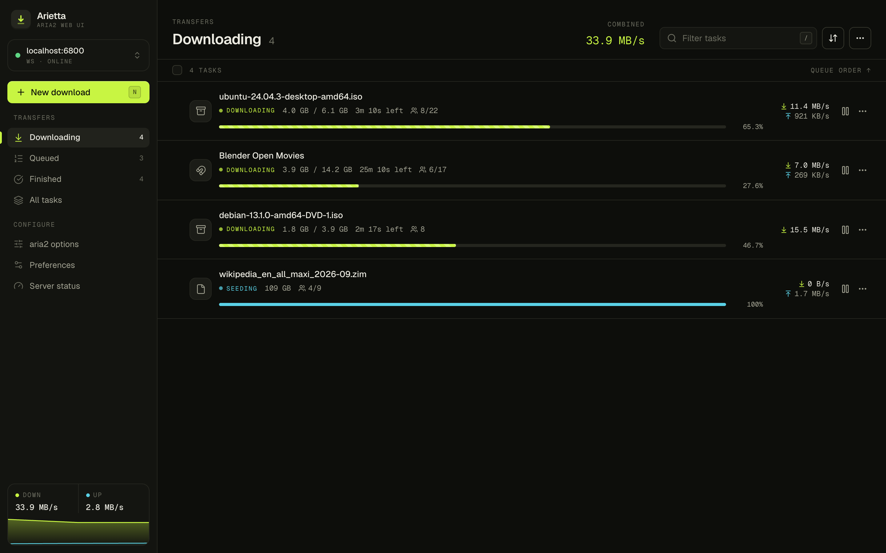 | 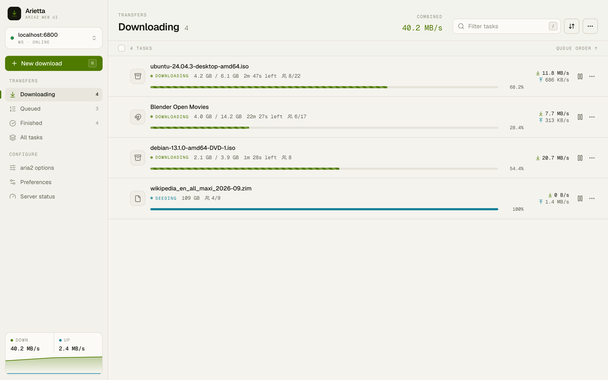 |

## Task files

File tree of a multi-file torrent with per-file progress and selection.

| Dark | Light |
|---|---|
| 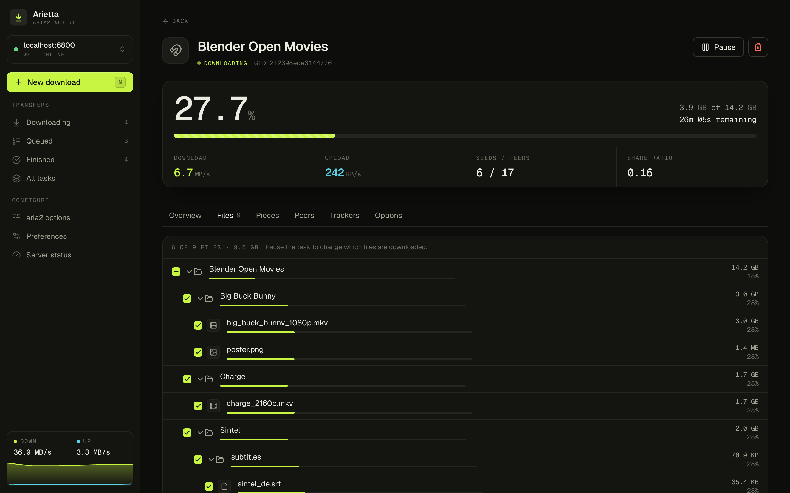 | 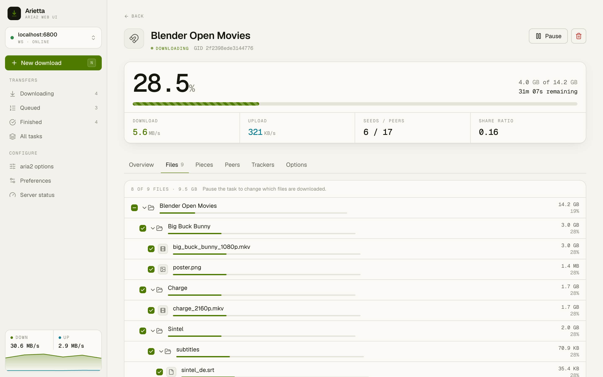 |

## Task peers

Connected peers with client detection, availability and transfer speeds.

| Dark | Light |
|---|---|
| 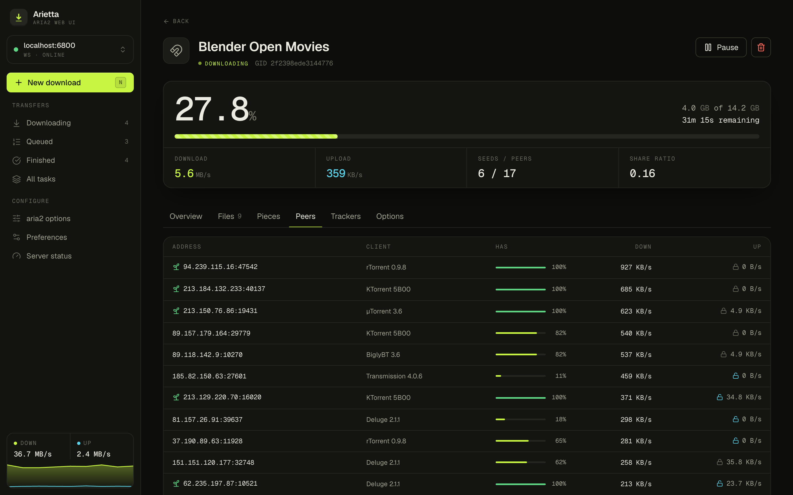 | 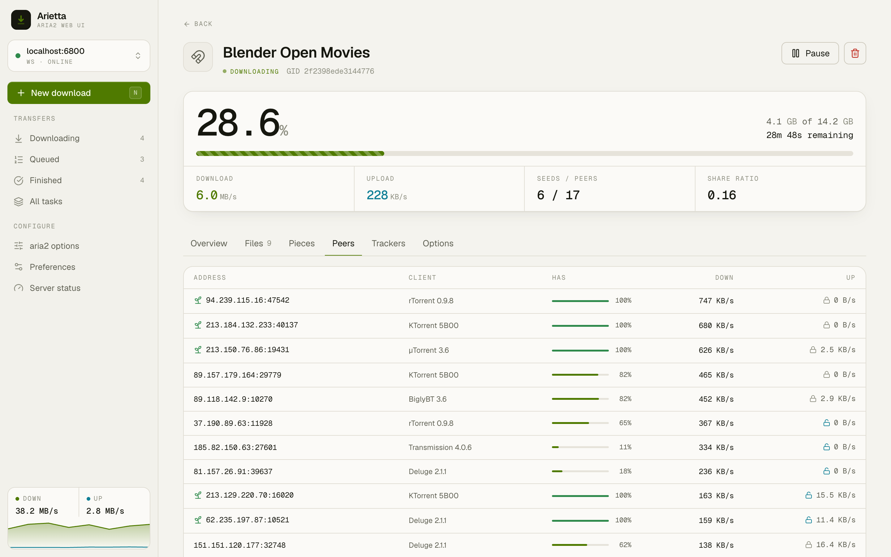 |

## New download

Add links, magnets, .torrent and .metalink files.

| Dark | Light |
|---|---|
| 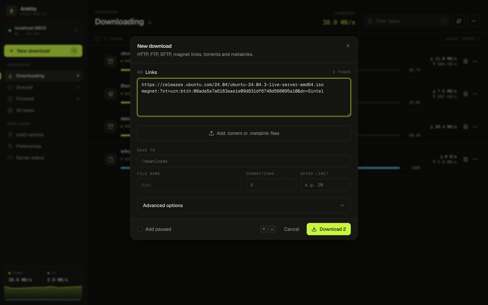 | 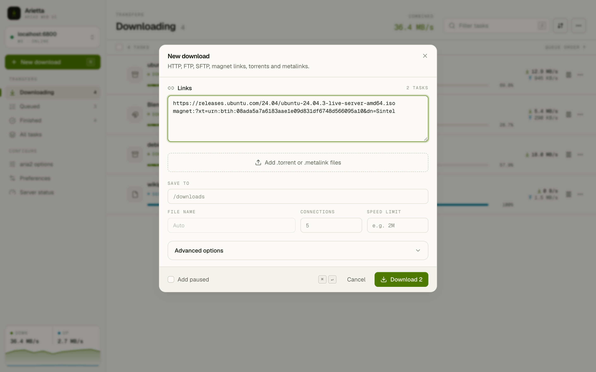 |

## Preferences

aria2 servers, appearance and behavior settings.

| Dark | Light |
|---|---|
| 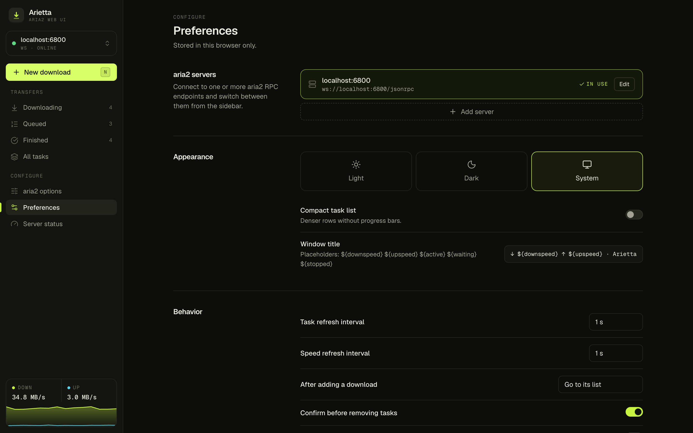 | 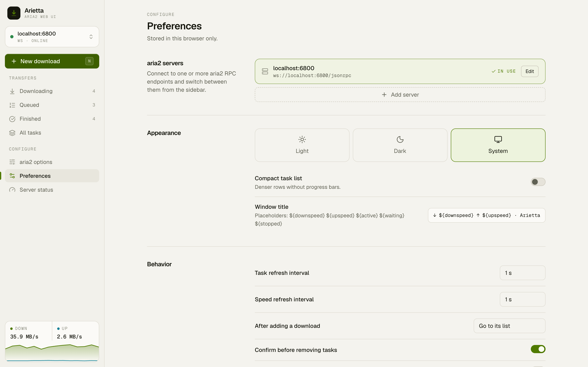 |

## Server status

aria2 version, session, live stats and enabled features.

| Dark | Light |
|---|---|
| 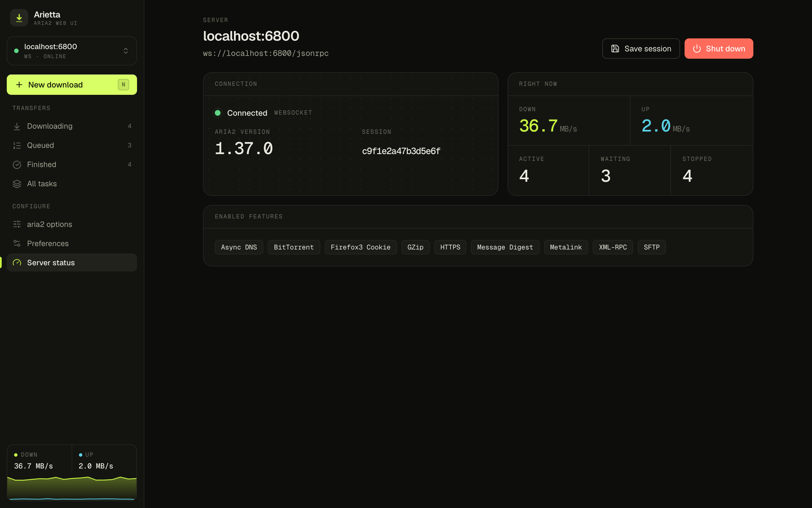 | 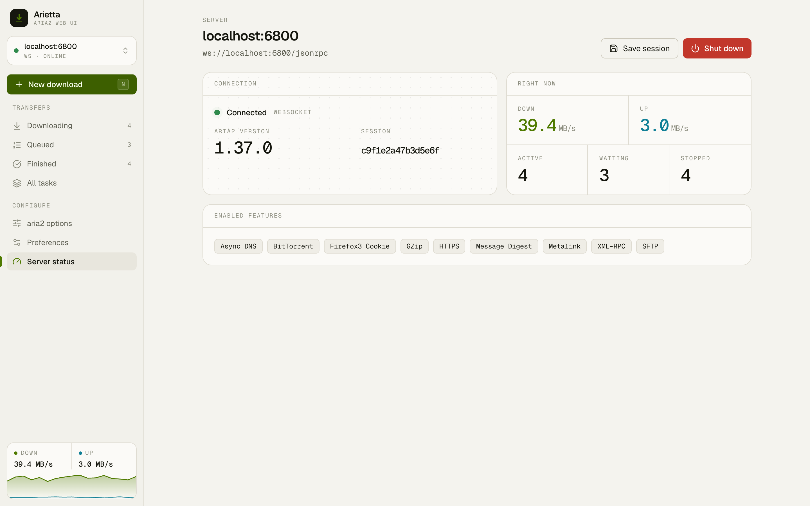 |
